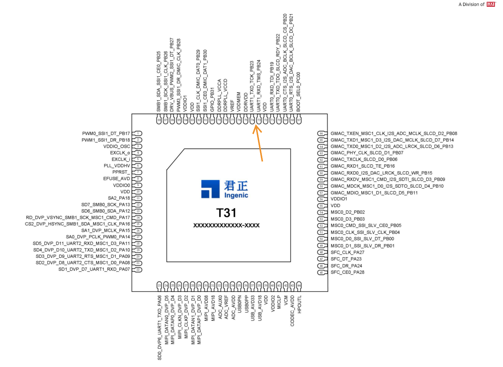
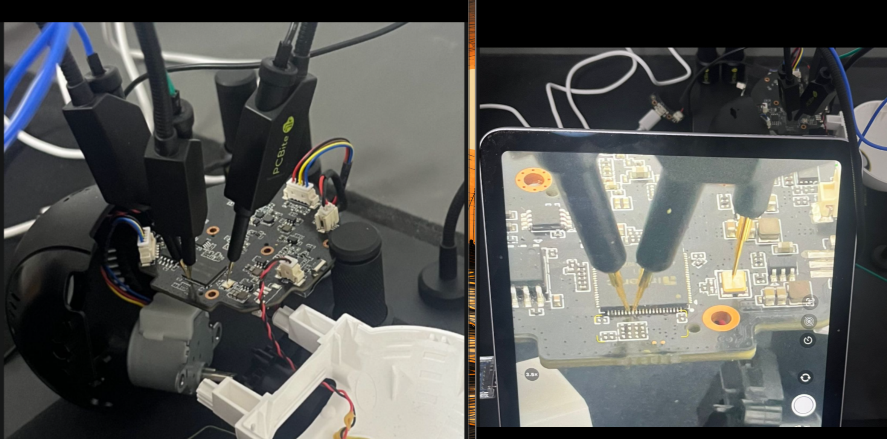

## The Scope 
In this repo i will show how i got access to the UART  interface even without the common  
set of exposed pins / test pads, using U-Boot to gain root on an early stage and eventually  
loading & dumping the firmware   

## Initial Recon  

There are a few key things clear from the PCB 
* Chip →T31 Ingenic Processor 
* Flash Memory → SOIC-8 SPI NOR type 
* Potential UART test pads  

First i went for the obvious candidates for a straightforward UART access,  
there are 4 test pads in a row that seems to be the Tx Rx Ground and power,  
but testing it with a multimeter gave the wrong readings as seen in the picture.  
I tried most of the other test pads and still could not find the correct reading so i had  
to switch strategy 

## Getting a foothold 
since there are no connectors left on the board nor any test pads that can help  
i decided to go through the source, connecting to the processor pins and getting  
a connection that way, i pulled the datasheet for that processor and identified  
the UART protocol pins  

Now we just need to find ground on the board, and connect 
* Tx → Rx
* Rx → Tx
* GND → GND  
 
I Used some PCBite probes & USB 2 TTL Adapter for this setup  
