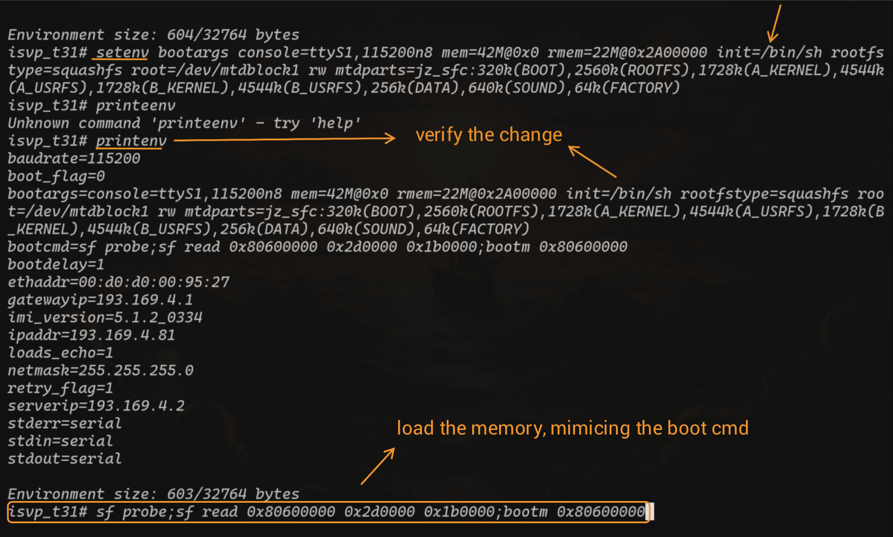
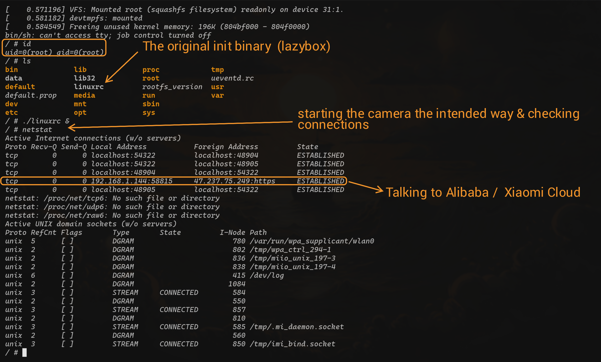
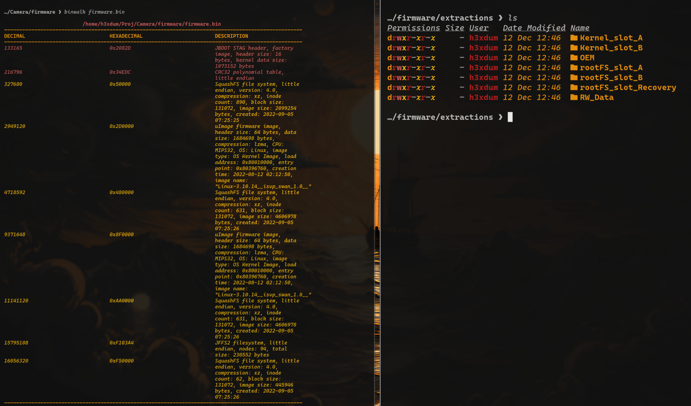

## The Scope 
In this repo i will show how i got access to the UART  interface even without the common  
set of exposed pins / test pads, using U-Boot and tricks to gain root on an early stage and  
eventually dumping the firmware 


## Initial Reconnaissance

There are a few key things clear from the PCB 
* Chip →T31 Ingenic Processor 
* Flash Memory → SOIC-8 SPI NOR type 
* Potential UART test pads  

First i went for the obvious candidates for a straightforward UART access,  
there are 4 test pads in a row that seems to be the Tx Rx Ground and power,  
but testing it with a multimeter gave the wrong readings as seen in the picture.  
I tried most of the other test pads and still could not find the correct reading so i had  
to switch strategy 

## Getting a foothold 
Since there are no connectors left on the board nor any test pads that can help  
I decided to go through the source, connecting to the processor pins and getting  
a UART shell that way, I pulled the datasheet for that processor and identified  
the UART protocol pins  


Now we just need to find ground on the board, and connect 
* Tx → Rx
* Rx → Tx
* GND → GND  
 
I Used some PCBite probes & USB 2 TTL Adapter for this setup   


## U-Boot & Root 
Now we can use `picocom` to get a the UART shell we are after 
```bash
sudo picocom -b 115200 /dev/ttyUSB0
```
If nothing is done, I only got the  boot logs and no shell at the end of the booting process  
so I had to interrupt U-Boot by pressing enter immediately.  
When getting a U-Boot shell I firstly printed the environment args  

The things important to us are
* bootargs →show the init command is to run the linuxrc binary & firmware layout  (partitions and their purpose /size/slots)
* bootcmd → The command to load the memory from flash to RAM and boot the device  

To get a quick root access I can use the trick of changing the init command with `setenv` 
so I get a shell instead of running the linuxrc binary, then I can load the memory 
manually and boot the device (essentially copying the bootcmd command)

Now when the boot will finish I will be dropped into an early shell with essentially nothing running  
on the system, so i'll run the original `linuxrc` binary in the background and check for 
any open ports on this system 

No luck! The camera only talks to its cloud on " _47.237.75.249_  ", no exposed web interface 
to tinker with.
Since reversing the cloud communication binary is out of scope for my research,  
this is where i decided to end my research :) 

## Firmware extraction 
A little extra for anyone who is interested in playing with the firmware, here's 
how to get it.  
Same setup as before with the UART but this time only probing & loading the  
memory from the flash into RAM but without booting into it.  
Then you can print the data from the RAM memory and record your terminal  
output (with `minicom` this time) to save to a file, clean it a bit with python and get  
the firmware, matching binwalk & bootargs help to name each section.  


